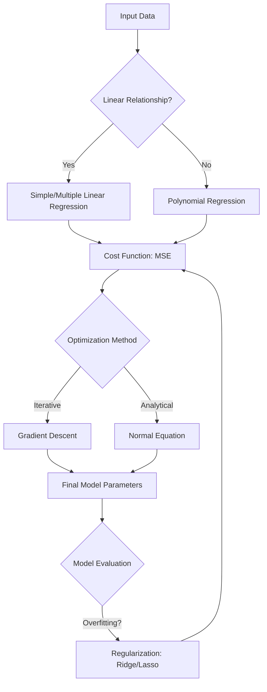

# Day 8-9: Supervised Learning - Regression

## Software Requirements Document (SRD)

### 1. Project Overview

The objective of this module is to master the mathematical foundations and conceptual frameworks of **Regression Analysis**. Regression is a fundamental Supervised Learning technique used to predict continuous numerical values based on input features. This project focuses on moving beyond "black-box" libraries and understanding the "how" and "why" behind the algorithms.

---

### 2. Theoretical Foundations

#### 2.1 Linear Regression

Linear Regression assumes a linear relationship between the input variables ($x$) and the single output variable ($y$).

- **Hypothesis Function**: Represented as a linear combination of features.
- **Cost Function**: The Mean Squared Error (MSE) is typically used to measure the average squared difference between estimated values and the actual value.
- **The Normal Equation**: A closed-form solution to find the value of parameters that minimizes the cost function.

#### 2.2 Gradient Descent Optimization (GD)

Gradient Descent is an iterative optimization algorithm used to minimize the cost function by repeatedly moving in the direction of steepest descent.

- **Learning Rate ($\alpha$)**: A tuning parameter that determines the step size at each iteration while moving toward a minimum.
- **Batch Gradient Descent**: Uses the entire dataset to calculate gradients.
- **Stochastic Gradient Descent (SGD)**: Uses a single random instance to calculate gradients, making it faster for large datasets.
- **Mini-batch Gradient Descent**: A compromise that uses small random subsets of data.

#### 2.3 Polynomial Regression

When data is more complex than a straight line, we can use Polynomial Regression. It models the relationship between $x$ and $y$ as an $n$-th degree polynomial. Although it fits a non-linear curve to the data, it is still considered a "linear" model because the parameters (weights) are linear.

---

### 3. Regularization Techniques

Regularization is used to prevent **overfitting** by adding a penalty term to the cost function.

#### 3.1 Ridge Regression (L2 Regularization)

- Adds a penalty equal to the square of the magnitude of coefficients.
- Forces the weights to be small but does not make them zero.
- Effective when many features have a small effect.

#### 3.2 Lasso Regression (L1 Regularization)

- Adds a penalty equal to the absolute value of the magnitude of coefficients.
- Can lead to zero coefficients, effectively performing **feature selection**.
- Useful when you suspect only a few features are actually relevant.

---

### 4. Mathematical Workflow Diagram

---

### 5. Exercise: House Price Prediction

The practical component involves predicting house prices based on features such as square footage, number of bedrooms, and neighborhood age.

> [!NOTE]
> **Exercise Objectives**:
>
> 1. Manually implement the Hypothesis and Cost functions.
> 2. Implement Gradient Descent from scratch to optimize parameters.
> 3. Compare the performance between Simple Linear and Polynomial models.
> 4. Apply Ridge and Lasso regularization to observe weight shrinkage.

> [!IMPORTANT]
> This exercise must be completed without high-level libraries like `scikit-learn` for the core algorithm logic to ensure a deep understanding of the underlying mathematics.
